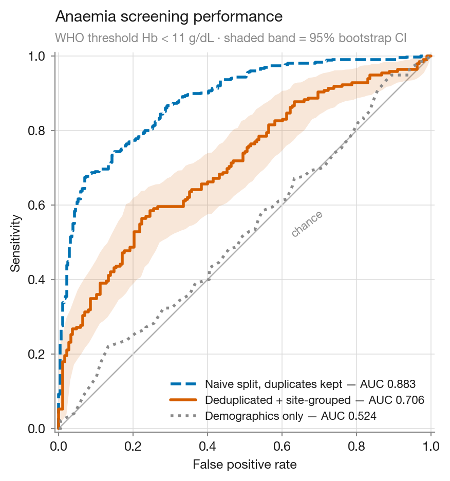
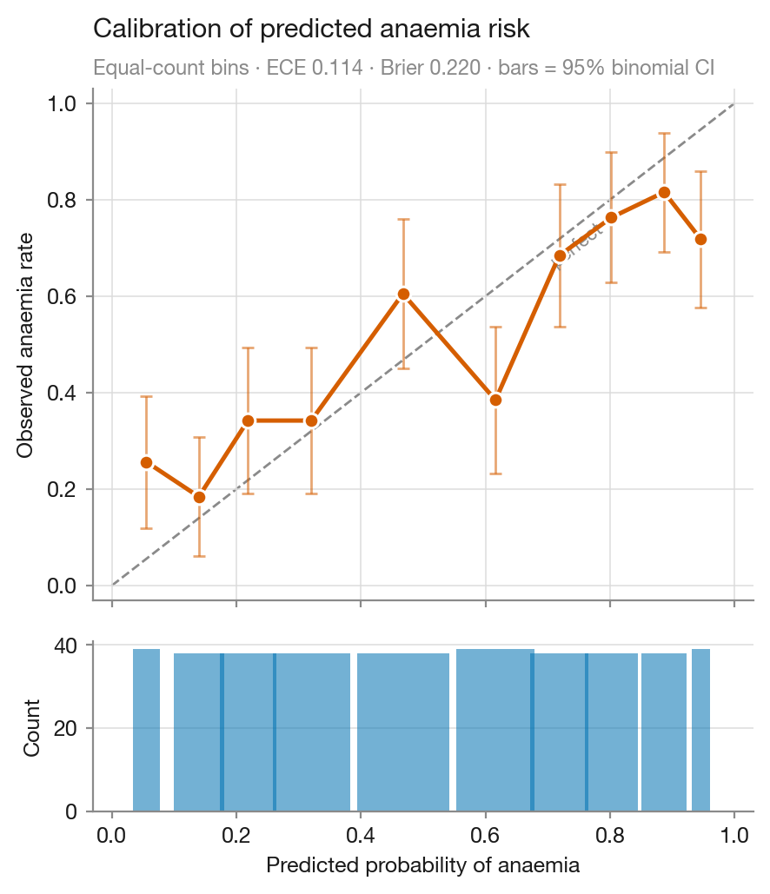
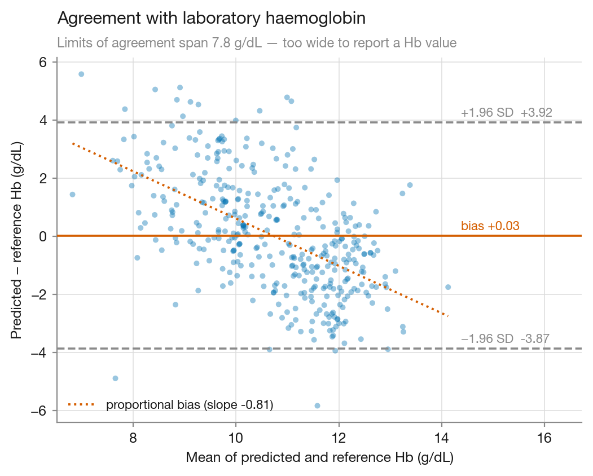
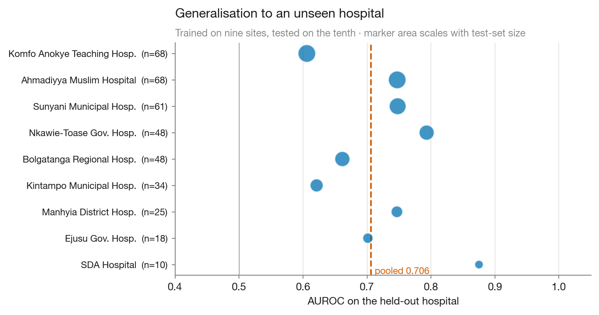
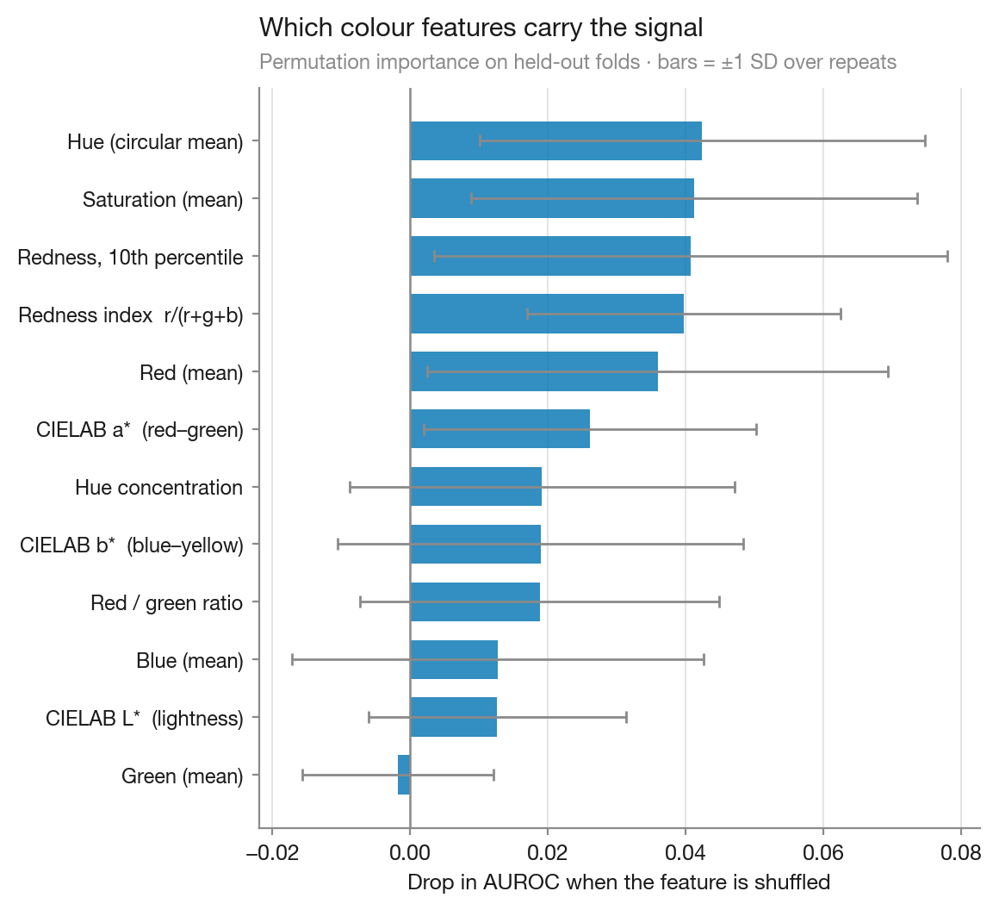
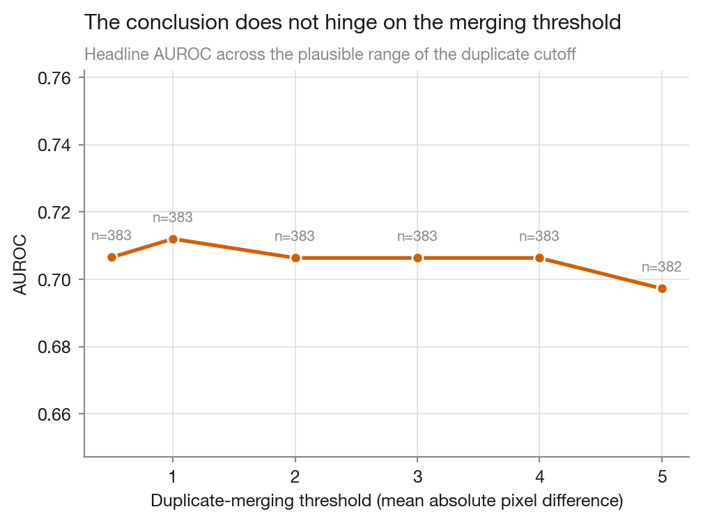
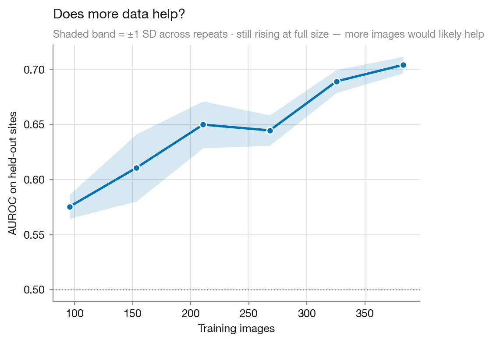

> **UPDATE (31 Aug 2026).** A third dedup pass (translation alignment of full-resolution
> canvases) found 96 further *shifted/re-cropped* copies that both hashing and thumbnail
> comparison miss. The distinct-photograph count is **383**, not 479, and the honest headline
> AUROC is **0.706 [0.653–0.757]** (total leakage inflation +0.176 vs the naive split). 125
> duplicate groups span more than one hospital, which defeats site-grouped CV as well as random
> splits. Numbers below this banner predate the third pass and are being revised; the current
> analysis output is `results/cp_anemic_summary.json` and the detector is
> `scripts/pass3_shift_dedup.py`.

# Conjunctival pallor screening on CP-AnemiC: duplicate leakage and an honest baseline

**Status:** software-only study on public data. No hardware, no patient recruitment, no clinical claims.
The current `python3 scripts/run_full_analysis.py` run (~9 min with the alignment pass, cached thereafter) produces the corrected numbers in the banner above; prose and figures below are being revised to match.

---

## Summary

Using the public CP-AnemiC dataset (710 conjunctiva photographs of Ghanaian children aged
6–59 months with paired laboratory haemoglobin), this study reports three things.

**1 · The benchmark contains duplicate leakage large enough to change conclusions.**
Of 710 metadata rows only **479 are distinct photographs**. 212 files are byte-identical copies
registered under different image IDs; a further 19 are re-encoded copies (13 exactly pixel-identical, 6 near-identical) after region-of-interest
extraction but differ at the byte level, so content hashing alone does not find them. Ninety
duplicate groups carry **conflicting haemoglobin on identical pixels** — one group spans
3.3 to 10.4 g/dL. Evaluating with a random split trains and tests on the same photograph and
inflates AUROC by **+0.103 (95 % CI +0.056 to +0.152, bootstrap p < 0.001)**.

**2 · After removing that redundancy, twelve interpretable colour features reach
AUROC 0.780 (95 % CI 0.737–0.818)** for WHO anaemia (Hb < 11 g/dL) under hospital-grouped
cross-validation, against a demographics-only floor of 0.565. The image contributes
**+0.215 AUROC (DeLong 95 % CI +0.151 to +0.279, p = 4.4 × 10⁻¹¹)**.

**3 · It is a triage screen, not a haemoglobin meter.** Bland–Altman limits of agreement span
**7.3 g/dL** (−3.65 to +3.70) with strong proportional bias (slope −0.67), so no haemoglobin
value from this model should be reported to a clinician.

---

## Data

| Property | Value |
|---|---|
| Source | CP-AnemiC, Mendeley Data [`m53vz6b7fx`](https://data.mendeley.com/datasets/m53vz6b7fx/1) |
| Metadata rows | 710 |
| Distinct images (SHA-256) | 498 |
| **Distinct images (pixel-level)** | **479** |
| Rows appearing exactly once | 407 |
| Duplicate groups with conflicting Hb | 90 |
| Label | Laboratory Hb (g/dL); WHO threshold 11 g/dL |
| Prevalence after dedup | 0.493 |
| Collection sites | 10 hospitals, 4 Ghanaian regions |
| Cohort | Children 6–59 months |

Each image is RGBA where **the alpha channel is a hand-drawn conjunctiva mask** covering ~25 % of
the frame; the rest is black padding. Colour statistics must be computed over masked pixels only —
ignoring the mask shifts mean RGB by more than 100/255 and yields features encoding *mask area*
rather than tissue colour.

---

## Method

Twelve interpretable colour features over the masked ROI: mean RGB; **circular** mean hue and hue
concentration; mean saturation; CIELAB `L*`, `a*`, `b*` (`a*` is the perceptual red–green axis a
clinician reads as pallor); an illumination-normalised redness index `r/(r+g+b)`; its 10th
percentile; and the red/green ratio.

Two deliberate exclusions:

- **Mask area is not a feature.** It reflects annotator behaviour, not physiology; had it
  correlated with site or severity the model would have learned the annotator.
- **Hue is averaged circularly.** Red tissue sits near both 0.0 and 1.0 on the hue circle, so a
  linear mean of 0.98 and 0.02 returns 0.5 — cyan.

A gradient-boosted regressor predicts haemoglobin; its output negated doubles as the screening
score. Hyperparameters were **fixed a priori and never tuned on this data**. All reported metrics
are out-of-fold.

---

## Results

### Progressive removal of optimism

Colour features only. Each row closes one more leak than the row above.

| Configuration | n | AUROC [95 % CI] | MAE (g/dL) |
|---|---|---|---|
| Random split, duplicates kept *(the common setup)* | 710 | 0.883 [0.858–0.906] | 1.46 |
| Exact duplicates removed, random split | 498 | 0.796 [0.758–0.834] | 1.44 |
| + grouped by collection site | 498 | 0.809 [0.772–0.847] | 1.42 |
| **+ pixel-level duplicates removed (headline)** | **479** | **0.780 [0.737–0.818]** | **1.46** |


### Ablation — does the camera contribute?

| Feature set | AUROC [95 % CI] | vs colour (DeLong) |
|---|---|---|
| Demographics only (age, sex) | 0.565 [0.514–0.618] | Δ −0.215, p = 4.4 × 10⁻¹¹ |
| **Colour only** | **0.780 [0.737–0.818]** | — |
| Colour + demographics | 0.769 [0.725–0.808] | Δ −0.011, p = 0.30 (no difference) |

The image adds real signal; demographics add nothing detectable on top of it.



### Model choice

Both models are reported because they answer different questions and the better one was not
quietly adopted after the fact.

| Model | AUROC [95 % CI] | Hb output | Agreement assessable |
|---|---|---|---|
| Hb regressor *(headline)* | 0.780 [0.737–0.818] | yes, MAE 1.46 g/dL | yes — LoA span 7.3 g/dL |
| Binary classifier | **0.818 [0.778–0.854]** | no | no |

The classifier discriminates better, as expected when optimising the decision directly, but
produces no haemoglobin estimate and so cannot be checked for clinical agreement. The regressor is
kept as the headline because the agreement finding is the more consequential result.

### Calibration — where the textbook advice fails

| Variant | Brier | ECE | Hosmer–Lemeshow p | AUROC | probability range |
|---|---|---|---|---|---|
| **Uncalibrated** | **0.174** | **0.054** | 0.021 | **0.818** | [0.01, 0.98] |
| Isotonic, `CalibratedClassifierCV(cv=3)` | 0.200 | 0.116 | < 0.001 | 0.788 | [0.00, 0.92] |

Wrapping the model in post-hoc calibration made calibration *and* discrimination **worse**. The
mechanism is visible in the last column: `CalibratedClassifierCV` fits k sub-models on k−1 folds
each and averages them, which pulls probabilities toward the centre, and at ~380 training rows each
sub-model is also data-starved. The result is systematic *under*-confidence — the opposite of the
over-confidence calibration is meant to cure. The uncalibrated model is used, and remains slightly
imperfect (H–L p = 0.021).



### Screening operating point

Sensitivity 0.775, specificity 0.630 at the WHO threshold. Tuned to catch 90 % of anaemic children,
specificity falls to **0.362** — referring roughly 64 % of healthy children. This, not AUROC, is the
number that decides deployability, and it is not yet good enough.

### Agreement as a haemoglobin estimator

Bias +0.03 g/dL; limits of agreement **−3.65 to +3.70 g/dL**; proportional-bias slope **−0.67**.
The model shrinks toward the population mean, over-predicting anaemic children and under-predicting
healthy ones. A useful non-invasive haemoglobin meter needs limits nearer ±1 g/dL.



### Cross-site generalisation (leave-one-site-out)

| Site | n | AUROC | Prevalence |
|---|---|---|---|
| Komfo Anokye Teaching Hospital | 94 | 0.703 | 0.33 |
| Ahmadiyya Muslim Hospital | 87 | 0.812 | 0.44 |
| Sunyani Municipal Hospital | 74 | 0.789 | 0.49 |
| Bolgatanga Regional Hospital | 63 | 0.764 | 0.51 |
| Nkawie-Toase Government Hospital | 55 | 0.864 | 0.62 |
| Kintampo Municipal Hospital | 40 | 0.688 | 0.57 |
| Manhyia District Hospital | 28 | 0.875 | 0.57 |
| Ejusu Government Hospital | 24 | 0.881 | 0.62 |
| SDA Hospital | 11 | 1.000 | 0.82 |
| Holy Family Hospital | 3 | — | — |

Mean 0.820 across nine evaluable sites (range 0.688–1.000). The perfect score at SDA Hospital is
n = 11 at 82 % prevalence and is noise, not performance; the informative observation is that the
*lowest* score belongs to the *largest* site.



### Which features carry the signal

Permutation importance measured **out-of-fold** (the model's own impurity importances are computed
on training data and biased toward continuous features, so they cannot support this claim):

| Feature | ΔAUROC when shuffled | SD |
|---|---|---|
| Saturation (mean) | 0.073 | 0.043 |
| Redness, 10th percentile | 0.055 | 0.032 |
| Hue (circular mean) | 0.040 | 0.029 |
| Redness index | 0.039 | 0.026 |
| Red (mean) | 0.034 | 0.024 |

Saturation and the pale tail of the redness distribution dominate — physiologically the expected
direction. Because these features are strongly correlated, a low score means "redundant given the
others", not "irrelevant".



---

## Controls

Every check below is designed to make the headline number *fail* if it is an artefact.

| Control | Result | Interpretation |
|---|---|---|
| **Label permutation** (10 repeats) | AUROC 0.507 ± 0.026 | Chance. The harness does not leak. |
| **Seed stability** (10 seeds) | 0.778 ± 0.003 (0.773–0.783) | The result is not fold-assignment luck. |
| **Bootstrap vs DeLong CI** | [0.737, 0.818] vs [0.738, 0.821] | Independent machinery, same interval. |
| **Byte-hash singles only** (n = 407) | 0.763 | Robustness check at the hash grain; a handful of re-encoded and shifted copies survive this filter, so it is not conflict-free. |
| **Nested-CV hyperparameter tuning** | 0.780 → 0.782 (Δ +0.003) | Fixed settings were not cherry-picked. |
| **Duplicate-threshold sweep** (0.5–5.0) | 0.774–0.784 | The conclusion does not hinge on the cutoff. |



### Would more data help?

| Training images | 120 | 191 | 263 | 335 | 407 | 479 |
|---|---|---|---|---|---|---|
| AUROC | 0.635 | 0.672 | 0.698 | 0.738 | 0.762 | **0.782** |

Still climbing at full size, so performance here is limited by **sample size as well as** the
dataset's irreducible label noise. A larger clean dataset would likely beat 0.780.



---

## Limitations

- **Label noise is irreducible.** 90 duplicate groups carry conflicting haemoglobin on identical
  pixels; merging took the median, which cannot recover the truth. A performance ceiling is baked
  into the dataset.
- **No colour calibration.** No colour card or white-balance reference was captured, so absolute
  RGB partly encodes illumination. The normalised ratios mitigate but do not remove this.
- **One country, one age band.** Children 6–59 months in Ghana. Nothing here supports use in
  adults, in pregnancy, or across different skin tones and camera pipelines.
- **Masks are hand-drawn.** A deployed system would need automatic conjunctiva segmentation, whose
  error is not represented anywhere in these numbers.
- **No true external validation.** Leave-one-site-out varies camera, operator and prevalence but
  not country or protocol. Validating on an independent dataset (e.g. Eyes-defy-anemia, Italian and
  Indian patients) is the obvious next step and is gated only on dataset access.
- **Not a clinical device.** No regulatory, ethical or safety assessment has been performed.

---

## Reproducing

```bash
pip install -r requirements.txt
# download CP-AnemiC (8.3 MB) from https://data.mendeley.com/datasets/m53vz6b7fx/1
# unpack into data/cp-anemic/   (RAR5 archive — `brew install unar` if needed)
python3 scripts/run_full_analysis.py
python3 -m pytest tests/ -q          # 62 tests, incl. adversarial leakage guards
```

Outputs in `results/`: the experiment matrix, per-site generalisation, permutation importance,
learning curve, threshold sweep, model and calibration comparisons, a machine-readable
`cp_anemic_summary.json`, and figures 1–8.

The test suite is organised by failure mode rather than by module — split integrity, feature
correctness, numerical robustness, determinism, statistical machinery, and adversarial nulls —
because the dangerous failure here is not a crash but a plausible wrong number.

## Data citation

Asare, J. W., Appiahene, P., & Donkoh, E. T. (2023). *CP-AnemiC: A conjunctival pallor dataset
and benchmark for anemia detection in children.* Mendeley Data, `m53vz6b7fx`.
Used under its published licence; no patient-identifiable data is stored in this repository.
