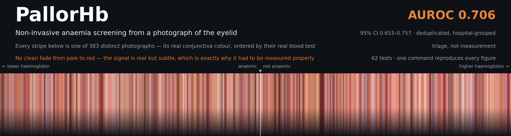
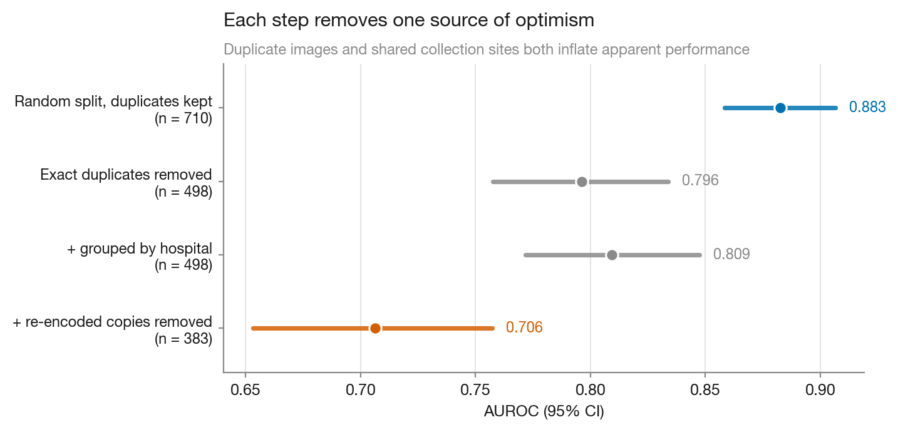

<p align="center">
  
</p>

<p align="center">
  <em>The banner is not decoration.</em> Every stripe is one distinct photograph in the dataset,
  filled with its true conjunctiva colour and ordered by laboratory haemoglobin — regenerate it with
  <code>python3 scripts/make_banner.py</code>. It is built from derived colour statistics only; no
  dataset photograph is redistributed here.
</p>

---

# PallorHb — Non-Invasive Point-of-Care Anemia Screening

**Estimating blood hemoglobin (Hb) without a needle**, from a low-cost photoplethysmography (PPG)
front-end and/or a smartphone image of the palpebral conjunctiva — and flagging anemia against WHO
thresholds. Built as an end-to-end ML + embedded-hardware system: sensor → signal/feature extraction
→ calibrated regression model → clinical decision, with an honest validation story (error bars, not
just a single accuracy number).

> **Status:** the conjunctiva imaging modality now runs on **real public data** (CP-AnemiC, 710
> images with paired lab Hb). The PPG modality remains synthetic-only pending hardware.
> See the [12-week roadmap](ROADMAP.md).

---

## Headline result

On the public **CP-AnemiC** dataset (Ghanaian children 6–59 months, paired laboratory Hb), twelve
interpretable colour features detect WHO anaemia (Hb < 11 g/dL) with:

**AUROC 0.706 (95 % CI 0.653–0.757)** — fully deduplicated images (three passes, n=383), cross-validated grouped by hospital.

Three findings matter more than that number:

1. **CP-AnemiC has duplicate leakage large enough to change conclusions.** 710 metadata rows
   resolve to only **383 distinct photographs** across three duplicate forms — byte-identical
   files, re-encoded copies, and shifted/re-cropped copies of one photograph saved under different
   IDs (often attributed to different hospitals). 116 final-grain groups carry *conflicting* Hb on
   the same photograph (one spans 3.3–10.4 g/dL), and 125 groups span more than one site — which
   defeats even site-grouped CV. The naive random split inflates AUROC by
   **+0.176** (95 % CI +0.120 to +0.232, p < 0.001).
2. **The camera earns its place.** Demographics-only floor is 0.524; the image adds
   **+0.182 AUROC** (DeLong p = 2 × 10⁻⁶).
3. **It is a triage screen, not a haemoglobin meter.** Bland–Altman limits of agreement span
   **7.8 g/dL** — ranking works, absolute Hb does not.

<p align="center">
  
</p>

Controls designed to make the result fail: label permutation **0.529 ± 0.032** (chance);
10-seed stability **0.702 ± 0.006**; nested-CV hyperparameter tuning does not help (−0.044 —
honest evidence the fixed settings were not cherry-picked). Sensitivity: the result is flat across
thumbnail thresholds 0.5–5.0, and varies 0.685–0.728 across alignment thresholds 1.0–4.0 (reported,
not hidden).

**→ Full method, tables, controls, figures and limitations: [FINDINGS.md](FINDINGS.md)**

```bash
pip install -r requirements.txt
# unpack CP-AnemiC into data/cp-anemic/ — see FINDINGS.md
python3 scripts/run_full_analysis.py     # ~80 s, writes results/ and figures 1–8
python3 -m pytest tests/ -q              # 62 tests incl. adversarial leakage guards
```

---

## Why this matters

Anemia affects roughly **2 billion people** and is a leading cause of morbidity in pregnancy and
childhood, disproportionately in low-resource settings. The gold standard (a venous draw + lab CBC,
or a HemoCue cuvette) needs consumables, a phlebotomist, and cold-chain logistics. A **non-invasive,
reagent-free, sub-$20 screener** that runs on a microcontroller would let community health workers
triage who actually needs a confirmatory lab test.

This is *screening*, not diagnosis. The design target is high **sensitivity** at the WHO anemia cutoff
(so few true anemics are missed), with the model's uncertainty surfaced rather than hidden.

## The clinical target

| Population        | Anemia threshold (Hb) |
|-------------------|-----------------------|
| Children 6–59 mo  | < 11.0 g/dL           |
| Non-preg. women   | < 12.0 g/dL           |
| Pregnant women    | < 11.0 g/dL           |
| Men               | < 13.0 g/dL           |

Success is measured against a **reference Hb** (lab CBC or HemoCue) using:
- **MAE / RMSE** in g/dL and **Bland–Altman** limits of agreement (the right tool for method
  comparison — a high R² can still hide a clinically unacceptable bias).
- **Sensitivity / specificity** at the population-appropriate cutoff, with the operating point chosen
  to prioritise sensitivity.

## Approach

Two complementary, cheap modalities:

1. **PPG (primary).** A reflectance PPG sensor (e.g. MAX30102, red + IR) on a fingertip. Hb and blood
   volume change the absorption of red/IR light; waveform morphology and the red/IR ratio carry
   information about Hb. This reuses analog-front-end skills from my [EMG project](https://github.com/).
2. **Conjunctiva pallor (secondary).** A colour-calibrated image of the lower-eyelid conjunctiva;
   pallor (reduced redness) correlates with low Hb. Handled as a colour-feature regression with a
   reference colour card for white balance.

Pipeline: `capture → preprocess/QC → feature extraction → regression (calibrated) → Hb estimate + anemia flag + uncertainty`.

## What runs today

```bash
python -m venv .venv && source .venv/bin/activate
pip install -r requirements.txt

# Train + evaluate on synthetic PPG-feature data (writes plots + metrics to results/)
python -m pallor_hb.train --modality ppg --n 2000 --seed 0
```

This generates a physiologically-motivated synthetic dataset, fits a gradient-boosted regressor,
and writes `results/metrics.json`, a Bland–Altman plot, and a predicted-vs-actual plot. It is a
**placeholder for real data** — the point is that the feature extraction, model, and clinical
evaluation are wired together and unit-tested from day one.

## Repository layout

```
pallor-hb/
├── README.md
├── ROADMAP.md              # 12-week milestone plan
├── requirements.txt
├── src/pallor_hb/
│   ├── dataset.py          # loaders + synthetic data generator
│   ├── features.py         # PPG waveform + conjunctiva colour features
│   ├── model.py            # regression model wrapper
│   ├── evaluate.py         # MAE/RMSE, Bland–Altman, sensitivity/specificity
│   ├── train.py            # end-to-end train/eval entry point
│   ├── experiment.py       # split strategies, ablations, controls
│   ├── stats.py            # DeLong test, bootstrap CIs, calibration
│   └── plots.py            # publication figures, one shared house style
├── scripts/
│   ├── run_full_analysis.py  # single entry point for the CP-AnemiC study
│   └── make_banner.py        # README banner, generated from the data
├── hardware/               # PPG front-end board (rev A) + capture notes
├── data/                   # dataset pointers (no PHI committed)
├── results/                # figures + metric tables (regenerated)
└── tests/                  # 62 tests, organised by failure mode
```

## Datasets (real data, to be integrated)

See [`data/README.md`](data/README.md) for pointers to public non-invasive-Hb datasets and the plan
for collecting a small IRB-appropriate paired (PPG, reference-Hb) set. **No patient data is committed
to this repo.**

## Honest limitations

- Skin tone, perfusion, motion, and ambient light are real confounders; the model must be validated
  *across* skin tones or it will fail the people it most needs to serve.
- This is a personal research/portfolio project, **not a medical device** and not for clinical use.
- Full limitations for the CP-AnemiC study are in [FINDINGS.md](FINDINGS.md#limitations).

## Provenance and attribution

Stated plainly so anyone reading or assessing this work knows exactly what it is.

**Data.** The CP-AnemiC dataset is third-party and public — Asare, Appiahene & Donkoh (2023),
Mendeley Data [`m53vz6b7fx`](https://data.mendeley.com/datasets/m53vz6b7fx/1) — used under its
published licence and cited in [FINDINGS.md](FINDINGS.md#data-citation). I did not collect it. No
dataset images or patient data are committed to this repository; the loader reads a local copy that
each user downloads themselves.

**What this repository contributes.** The dataset-integrity audit (duplicate detection at byte, pixel and shifted-copy
level, and the finding that 116 final-grain duplicate groups carry conflicting haemoglobin labels), the
leakage quantification, the mask-aware feature extraction, the evaluation design, and the controls.
The reported AUROC is not a state-of-the-art claim — it is what remains after the duplicate
structure and site grouping documented here are accounted for, which is why it sits below
previously published figures on this dataset.

**Prior work.** The published CP-AnemiC benchmark and subsequent papers using it are cited in
FINDINGS.md. Where my numbers disagree with theirs, the disagreement is attributed to evaluation
methodology and the evidence is included so a reader can check it rather than take my word.

**Verifiability.** Nothing here asks to be taken on trust.
`python3 scripts/run_full_analysis.py` regenerates every number and figure deterministically in
about 80 seconds, and `pytest tests/` runs 62 checks including adversarial leakage guards. Any
claim in this repository can be independently reproduced from source.

**Status.** Independent portfolio research, not affiliated with or endorsed by UCL, and not
peer-reviewed.

## License

MIT — see [LICENSE](LICENSE). The CP-AnemiC dataset is **not** covered by this licence; see its own
terms on Mendeley Data.
